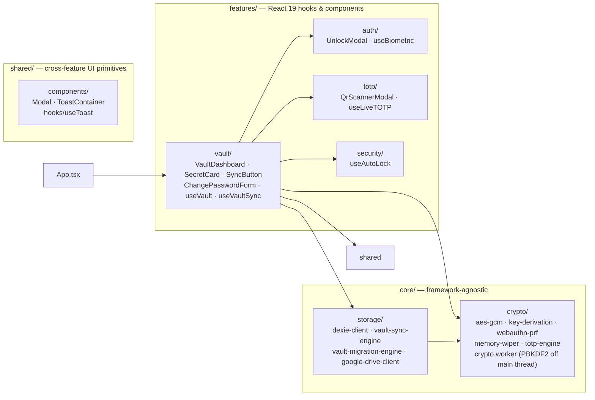

# 🔐 Zero-Knowledge Vault — "Vùng bảo mật" (secret-vault)

A **zero-knowledge**, fully client-side password, secret & TOTP (2FA) manager. Every encryption and
decryption operation happens locally in the browser via the native **Web Crypto API** — no server, no
backend, no analytics call ever sees your master password, derived key, or plaintext secrets.

> The internal/project name is still `secret-vault` (a.k.a. "Zero-Knowledge Vault"), but the UI itself is
> branded **"Vùng bảo mật"** (Vietnamese for "Security Zone") — see [`docs/TECH_SPEC.md`](docs/TECH_SPEC.md)
> for a note on where the branding lives (`index.html` `<title>` + the dashboard header).
>
> Built to prove a **"$0/month FinOps"** thesis: all compute happens client-side, and the only optional
> network dependency is *your own* Google Drive (BYOC — Bring Your Own Cloud) used purely as an encrypted
> blob store for multi-device sync.

---

## ✨ Features

### Shipped today

| Feature | Details |
| --- | --- |
| **Zero-Knowledge storage** | Every field (title, username, password, TOTP secret) is serialized to one JSON blob and encrypted with AES-256-GCM before it ever touches IndexedDB. Only `id`, timestamps and a `isDeleted` flag are stored as plaintext. |
| **AES-256-GCM encryption** | Native `crypto.subtle`, fresh random 96-bit IV per encryption call (no IV reuse, ever), 128-bit auth tag for tamper detection. |
| **PBKDF2-SHA256 key derivation** | 600,000 iterations (OWASP 2023+ recommendation), 16-byte random salt, non-extractable `CryptoKey` — the raw key material can never leave the browser's secure key store. |
| **Canary verification** | A known plaintext string is encrypted at vault-creation time and used to validate the master password on every unlock, without ever comparing password hashes directly. |
| **Local brute-force throttling** | 5 wrong attempts → 60s UI lockout, tracked in `localStorage`. |
| **Multi-tenant local isolation** | Each master password deterministically routes to its own physically separate IndexedDB (`ZeroKnowledgeVaultDB_<vaultId>`), so multiple users on the same browser/device never share data. |
| **Offline TOTP (2FA)** | Hand-rolled RFC 6238 engine (HMAC-SHA1 + dynamic truncation) — no third-party OTP library. Live 6-digit code with a real-time 30s countdown ring. |
| **QR code scanner** | Camera-based `otpauth://` URI scanning via `jsQR`, 100% offline, no image ever leaves the device. |
| **Auto-lock on inactivity** | Wipes the in-memory master key and re-locks the UI after 5 minutes without `mousemove`/`keydown`/`touchstart`/`scroll`. |
| **Clipboard auto-wipe** | Copied passwords/OTPs are overwritten in the clipboard 30s after copying (only if the clipboard still holds the value we wrote, so we never clobber the user's newer copy). |
| **Tombstone soft-delete** | Deletes never hard-remove a record; they flip an `isDeleted` flag so the deletion can propagate correctly across devices during sync. |
| **Cross-device Google Drive sync** | Record-level Last-Write-Wins merge against an encrypted blob stored in Google Drive's hidden `appDataFolder`, plus a **salt-adoption + forced-relogin** protocol that makes first-time sync on a brand-new device work correctly even though it started with a different local salt. |
| **Memory hygiene** | Sensitive `Uint8Array`/`ArrayBuffer` buffers (raw password, decrypted plaintext, HMAC signatures) are explicitly zero-filled immediately after use. |
| **Off-main-thread key derivation** | The 600,000-round PBKDF2 derivation runs inside a dedicated Web Worker (`core/crypto/crypto.worker.ts` + `KeyDerivationWorkerClient`), using Transferable `Uint8Array` buffers so the raw password bytes never linger on the main thread and the UI stays responsive while unlocking. |
| **Biometric unlock (WebAuthn PRF)** | Optional Touch ID / Face ID / Windows Hello unlock. A WebAuthn PRF-derived key wraps (AES-GCM) the in-memory master key, which is stored (wrapped) in the vault's `meta` record; unlocking re-derives the PRF secret via a platform authenticator assertion and unwraps the key — no PBKDF2 needed on this path (~50ms vs. the ~500ms of a full password unlock). See `core/crypto/webauthn-prf.ts`, `useVault.ts`'s `enableBiometric`/`disableBiometric`/`unlockWithBiometric`. |
| **Master password change (key rotation)** | Re-derives a brand-new salt + master key from a new password, re-encrypts every record with a fresh random IV, migrates to a newly-named IndexedDB database, and physically deletes the old database — see `core/storage/vault-migration-engine.ts` + `ChangePasswordForm.tsx`. As a side effect, this migration also purges any tombstone older than 30 days (a **partial** implementation of tombstone GC — see Known Gaps below). |

### Known gaps / Roadmap (not implemented yet — see [`docs/TECH_SPEC.md`](docs/TECH_SPEC.md) §8 for full detail)

* ⚠️ **Tombstone garbage collection** — only happens as a side effect of the "change master password" migration (records older than 30 days are dropped then). Regular Google Drive sync (`vault-sync-engine.ts`) never purges tombstones, so they persist indefinitely for vaults that never rotate their password.
* ❌ **PWA packaging** — no `manifest.json` or service worker yet; the app is not installable/offline-capable as a PWA despite that being a product goal.
* ⚠️ **Passkeys / WebAuthn unlock** — biometric unlock (Touch ID/Face ID/Windows Hello via WebAuthn PRF) is implemented as a *convenience unlock* on top of the master password (see Features table above), but there's no full passwordless passkey-only account model — the master password + PBKDF2 flow is still the primary/fallback path.

---

## 🏗️ Architecture

The codebase strictly separates **framework-agnostic core logic** (pure TypeScript, testable in Node)
from **React-specific UI/state** (Feature-Sliced Design):



See [`docs/TECH_SPEC.md`](docs/TECH_SPEC.md) for the full technical specification — key derivation
parameters, the canary auth flow, the cross-device sync/salt-adoption protocol, CSP configuration, and a
transparent list of known implementation gaps — and [`docs/PRD_SDD.md`](docs/PRD_SDD.md) for the product
requirements and STRIDE threat model.

## 🛠️ Tech Stack

| Layer | Technology |
| --- | --- |
| UI | React 19, TypeScript 6 (strict), Vite 8 |
| Styling | Tailwind CSS v4 (CSS-first config via `@tailwindcss/vite`, no `tailwind.config.js` needed), `lucide-react` icons, `framer-motion` animations |
| Storage | Dexie.js 4 (IndexedDB wrapper), Google Drive REST API v3 (`appDataFolder`, BYOC sync) |
| Crypto | Native Web Crypto API (AES-256-GCM, PBKDF2-SHA256 in a dedicated Web Worker, HMAC-SHA1 for TOTP, WebAuthn PRF for biometric unlock) — zero third-party crypto libraries |
| 2FA | Hand-rolled RFC 6238 TOTP engine + `jsqr` for camera QR scanning |
| Testing | Vitest 4 + `fake-indexeddb` (real-module integration tests, not mocks) |
| Linting/Formatting | ESLint 10 (flat config) + `typescript-eslint` + `eslint-plugin-react-hooks`, Prettier 3 (+ `prettier-plugin-tailwindcss` for class sorting) |
| Deployment | Vercel Edge Network with strict CSP / COOP / Permissions-Policy headers (`vercel.json`) |

## 📁 Project Structure

```text
src/
├── core/                     # Framework-agnostic, pure TypeScript
│   ├── crypto/                # AES-GCM engine, PBKDF2 key derivation (+ Web Worker), WebAuthn PRF,
│   │                           # memory wiping, TOTP (RFC 6238)
│   └── storage/                # Dexie schema/client, Google Drive client, LWW sync engine,
│                                 # vault migration engine (password change / key rotation)
├── features/                 # React 19 feature slices
│   ├── auth/                   # Master password unlock modal + biometric (WebAuthn) unlock hook
│   ├── vault/                   # Dashboard, secret cards, CRUD + sync hooks, clipboard wiper,
│   │                             # change-password form, sync button
│   ├── totp/                    # Live OTP countdown hook, camera QR scanner
│   └── security/                # Inactivity auto-lock hook
├── shared/                   # Cross-feature UI primitives: Modal, ToastContainer, useToast
└── App.tsx                   # Entry point (renders <VaultDashboard />)
```

## 🚀 Getting Started

This repo uses **Yarn** exclusively (`yarn.lock` is the only lockfile committed — never run `npm install`,
it will silently desync the lockfile).

```bash
# Install dependencies
yarn install

# Run dev server
yarn dev

# Run tests (no package.json script defined yet — invoke vitest directly)
npx vitest run

# Type-check the whole project
npx tsc -b

# Lint (zero warnings allowed)
yarn lint

# Format
yarn format        # write
yarn format:check  # check only

# Build for production
yarn build
```

### Google Drive Sync setup (optional)

Cloud sync is optional — the vault is fully usable 100% offline without it. To enable multi-device sync:

1. Create an OAuth 2.0 Client ID in [Google Cloud Console](https://console.cloud.google.com/) with the
   `https://www.googleapis.com/auth/drive.appdata` scope.
2. Replace `GOOGLE_CLIENT_ID` in [`src/features/vault/hooks/useVaultSync.ts`](src/features/vault/hooks/useVaultSync.ts) with your own client ID (the repo currently ships a working demo client ID for local development/testing — swap it for your own before deploying your own instance).
3. Never commit real OAuth client secret files — the `keys/` folder is already gitignored for this reason.

## 🔒 Security Model (summary)

Full STRIDE threat model and mitigations are documented in [`docs/PRD_SDD.md`](docs/PRD_SDD.md). Highlights:

* Master passwords are **never stored** — only used transiently to derive a `CryptoKey` via PBKDF2 (600,000 rounds, computed off the main thread in a dedicated Web Worker). The derived key is `extractable: true` (a deliberate trade-off, not an oversight) so it can be exported/wrapped for the optional biometric-unlock feature; raw exported key bytes are always zero-wiped from memory immediately after wrapping/importing.
* **All** secret fields (not just passwords) are encrypted at rest — there is no plaintext title/username stored anywhere on disk.
* AES-GCM's authentication tag means any single-bit tampering of stored ciphertext throws an `OperationError` and is refused, never silently decrypted.
* Sensitive buffers (raw password bytes, decrypted plaintext, HMAC signatures) are explicitly zero-wiped from memory immediately after use.
* Multi-tenant isolation: different master passwords on the same device/browser resolve to physically separate IndexedDB databases.
* Optional biometric unlock (Touch ID/Face ID/Windows Hello) wraps the master key with a WebAuthn PRF-derived key instead of storing the password — the platform authenticator still gates every unlock.
* Strict CSP, `X-Frame-Options: DENY`, and `Cross-Origin-Opener-Policy: same-origin-allow-popups` are enforced both via an HTML `<meta>` tag (dev) and Vercel HTTP headers (prod) — see §6 of the Tech Spec for a note on a current minor drift between the two.
* This project has **not** undergone a formal third-party security audit — use at your own risk for production secrets.

## 📄 License

This project is licensed under the [MIT License](LICENSE) — see the `LICENSE` file for details.
